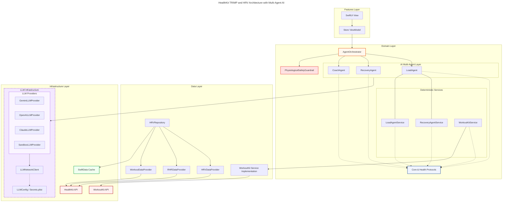
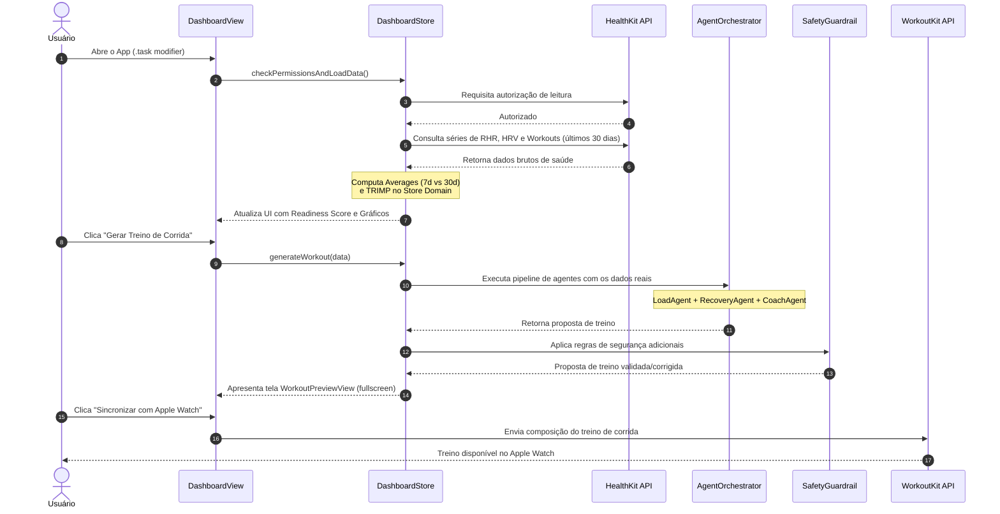

```markdown

# Documentação de Arquitetura: Telemetria de Saúde e IA Multiagente

Esta documentação descreve as camadas e o fluxo de dados do aplicativo **Beginner-Runner-AI-Coach**, detalhando como os sinais fisiológicos do usuário são coletados, processados deterministicamente e consumidos pela inteligência artificial para a prescrição segura de treinos de corrida.

---

## 1. Visão Geral das Camadas (Clean Architecture)

O projeto segue as diretrizes da **Clean Architecture** (Arquitetura Limpa), dividida em quatro camadas principais de responsabilidade isolada:

### A. Features Layer (Camada de Interface)
*   **Componentes**: `SwiftUI View` (ex: `VitalsDashboardView`) e `Observable ViewModel` (ex: `VitalsDashboardStore`).
*   **Papel**: Captura as interações do usuário e renderiza o HUD biológico (Bento Grid, Readiness Ring e Sparklines). A View reage a estados mutáveis (`@Observable`) emitidos pelo Store.

### B. Domain Layer (Camada de Regras de Negócio e Serviços)
*   **Serviços Determinísticos**:
    *   `LoadAgentService`: Implementa o cálculo fisiológico da fórmula de **Banister TRIMP (Training Impulse)** para quantificar a carga interna do treino com base na frequência cardíaca e duração.
    *   `RecoveryAgentService`: Computa as médias móveis simples de HRV (7 dias vs 30 dias de linha de base) para derivar o índice de prontidão biológica.
*   **AI Multi-Agent Layer (IA Orquestrada)**:
    *   `AgentOrchestrator`: Coordena a execução sequencial do pipeline de inteligência artificial.
    *   `LoadAgent`: Processa o histórico de treinos recentes e as pontuações de estresse cardíaco.
    *   `RecoveryAgent`: Analisa a tendência de HRV e frequência de repouso (RHR) para determinar fadiga.
    *   `CoachAgent`: Consome a síntese da carga e da recuperação para projetar a estrutura do treino customizado (aquecimento, tiros de corrida, caminhada de recuperação e desaquecimento).
*   **PhysiologicalSafetyGuardrail (Filtros de Segurança)**:
    *   Filtro pós-geração da IA que garante que o treino gerado não ultrapasse limites máximos de duração e intensidade cardíaca baseado no estado de fadiga do corredor (ex: limita o treino a um máximo de 60 minutos se houver fadiga acumulada).

### C. Data Layer (Camada de Acesso a Dados)
*   **Componentes**: `HRVRepository` e Providers específicos (`HRVDataProvider`, `RHRDataProvider`, `WorkoutDataProvider`).
*   **Papel**: Gerencia as consultas assíncronas do HealthKit e encapsula os dados salvos no banco de dados local.

### D. Infrastructure Layer (Camada de Integrações Externas)
*   **Frameworks Apple**:
    *   `HealthKit API`: Interface nativa da Apple para ler dados fisiológicos do usuário (HRV, RHR, histórico de exercícios).
    *   `WorkoutKit API`: Framework nativo para enviar as sessões de treino planejadas diretamente para o aplicativo **Exercícios (Workout)** do Apple Watch.
*   **Modelos de Linguagem (LLM Providers)**:
    *   Clientes de rede que implementam a interface comum de provedor de LLM para as APIs do **Google Gemini**, **OpenAI GPT**, **Anthropic Claude** e um **Provedor Mock** local utilizado no ambiente Sandbox de desenvolvimento.

---

## 2. Fluxo de Dados e Ciclo de Vida do Treino



### Detalhes das Etapas:
1. **Coleta de Sinais**: Ao carregar a tela, a aplicação puxa dados históricos das últimas quatro semanas para estabelecer uma linha de base estável do HRV do usuário.
2. **Cálculos Locais**: As tendências são calculadas de forma assíncrona. Se não existirem dados na janela de tempo (ex: novas contas), o dashboard exibe explicitamente o estado `"Sem dados"` ou `"INDISPONÍVEL"`, eliminando mockages invisíveis.
3. **Orquestração de Agentes**: O `AgentOrchestrator` injeta a telemetria processada (e as metas do usuário) no prompt contextual.
4. **Aplicação do Guardrail**: O código assegura que, mesmo se a inteligência artificial formular um treino exagerado para um usuário com status classificado como `"Fadigado"`, o filtro físico limite estritamente a duração e o esforço do treino de corrida.
5. **Sincronização Nativa**: O `WorkoutKit` recebe a resposta validada da IA estruturada em blocos e a serializa para o formato nativo suportado pelos sensores cardíacos do Apple Watch.
```