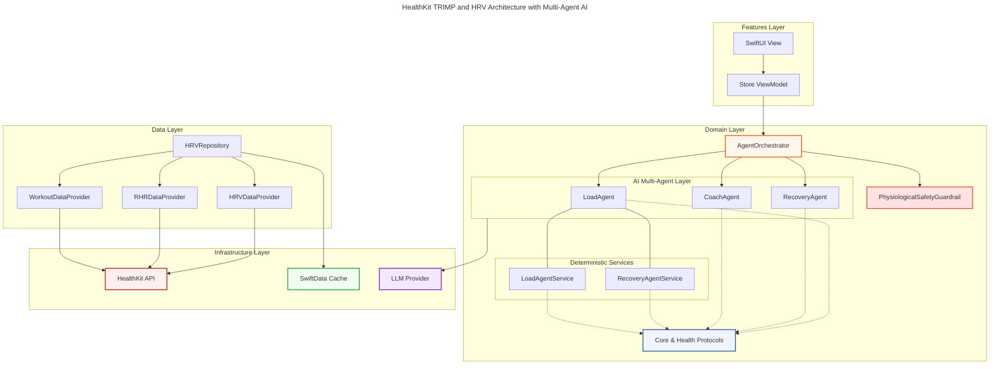

```mermaid
---
title: HealthKit TRIMP and HRV Architecture with Multi-Agent AI
---
flowchart TD
    subgraph Features [Features Layer]
        View[SwiftUI View]
        Store[Store ViewModel]
        View --> Store
    end

    subgraph Domain [Domain Layer]
        Orchestrator[AgentOrchestrator]
        
        subgraph AIAgents [AI Multi-Agent Layer]
            AILoad[LoadAgent]
            AIRecovery[RecoveryAgent]
            AICoach[CoachAgent]
        end
        
        subgraph DeterministicServices [Deterministic Services]
            RecoveryService[RecoveryAgentService]
            LoadService[LoadAgentService]
        end
        
        Safety[PhysiologicalSafetyGuardrail]
        Interfaces[Core & Health Protocols]
    end

    subgraph Data [Data Layer]
        Repo[HRVRepository]
        HRVProvider[HRVDataProvider]
        RHRProvider[RHRDataProvider]
        WorkoutProvider[WorkoutDataProvider]
    end

    subgraph Infrastructure [Infrastructure Layer]
        HealthKit[HealthKit API]
        SwiftData[SwiftData Cache]
        LLM[LLM Provider]
    end

    %% Data Flow & Dependencies
    Store --> Orchestrator
    
    Orchestrator --> AILoad
    Orchestrator --> AIRecovery
    Orchestrator --> AICoach
    Orchestrator --> Safety
    
    AILoad -.-> Interfaces
    AIRecovery -.-> Interfaces
    AICoach -.-> Interfaces
    
    AILoad --- RecoveryService
    AILoad --- LoadService
    
    AIAgents --> LLM
    
    RecoveryService -.-> Interfaces
    LoadService -.-> Interfaces
    
    Repo --> HRVProvider
    Repo --> RHRProvider
    Repo --> WorkoutProvider
    
    HRVProvider --> HealthKit
    RHRProvider --> HealthKit
    WorkoutProvider --> HealthKit
    Repo --> SwiftData

    %% Styling
    style Interfaces fill:#f0f4ff,stroke:#2b5797,stroke-width:2px
    style HealthKit fill:#fff0f0,stroke:#b91d1d,stroke-width:2px
    style SwiftData fill:#f0fff0,stroke:#16a34a,stroke-width:2px
    style LLM fill:#f3e8ff,stroke:#7e22ce,stroke-width:2px
    style Safety fill:#fee2e2,stroke:#ef4444,stroke-width:2px
    style Orchestrator fill:#fff7ed,stroke:#ea580c,stroke-width:2px
```