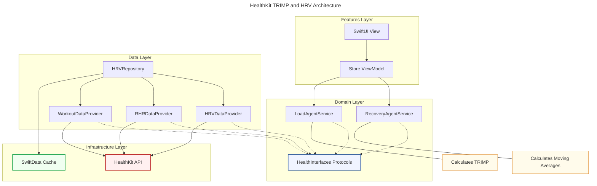

```mermaid
---
title: HealthKit TRIMP and HRV Architecture
---
flowchart TD
    subgraph Features [Features Layer]
        View[SwiftUI View]
        Store[Store ViewModel]
        View --> Store
    end

    subgraph Domain [Domain Layer]
        RecoveryAgent[RecoveryAgentService]
        LoadAgent[LoadAgentService]
        Interfaces[HealthInterfaces Protocols]
    end

    subgraph Data [Data Layer]
        Repo[HRVRepository]
        HRVProvider[HRVDataProvider]
        RHRProvider[RHRDataProvider]
        WorkoutProvider[WorkoutDataProvider]
    end

    subgraph Infrastructure [Infrastructure Layer]
        HealthKit[HealthKit API]
        SwiftData[SwiftData Cache]
    end

    %% Data Flow & Dependencies
    Store --> RecoveryAgent
    Store --> LoadAgent
    
    RecoveryAgent -.-> Interfaces
    LoadAgent -.-> Interfaces
    
    Repo --> HRVProvider
    Repo --> RHRProvider
    Repo --> WorkoutProvider
    
    HRVProvider -.-> Interfaces
    RHRProvider -.-> Interfaces
    WorkoutProvider -.-> Interfaces
    
    HRVProvider --> HealthKit
    RHRProvider --> HealthKit
    WorkoutProvider --> HealthKit
    Repo --> SwiftData

    %% Responsibilities
    RecoveryAgent --- note1[Calculates Moving Averages]
    LoadAgent --- note2[Calculates TRIMP]

    %% Styling
    style Interfaces fill:#f0f4ff,stroke:#2b5797,stroke-width:2px
    style HealthKit fill:#fff0f0,stroke:#b91d1d,stroke-width:2px
    style SwiftData fill:#f0fff0,stroke:#16a34a,stroke-width:2px
    style note1 fill:#fffbeb,stroke:#d97706
    style note2 fill:#fffbeb,stroke:#d97706
```